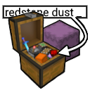
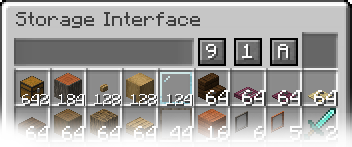

# Vanilla Storage Interface Mod

  

**A sleek, Vanilla-oriented storage terminal mod for Minecraft 1.21.1 (Fabric).**

If you wish to have this mod ported to a newer/older version of the game, or see new block variants or features added, do let me know in the [Discussions](https://github.com/Red-and-White-Fox/Vanilla-Storage-Interface/discussions) section or create a new feature request using [this template](https://github.com/Red-and-White-Fox/Vanilla-Storage-Interface/issues/new?template=feature_request.md) :).

### So you ask *why*?

> **Long story short: I wanted to solve one of my biggest problems in my long-term world – item storage.**
> The goal was to come up with a stupidly simple way of storing and accessing large quantities of items ***conveniently*** in one place, using nothing but Vanilla Minecraft inventories (primarily Chests and Shulker Boxes).

If you aren't a fan of digging through massive walls of chests and sifting through countless Shulker Boxes, this mod might be perfect for you! 😊🌸

The mod adds one block, the **Storage Interface**, which acts as a smart terminal for your existing storage. Simply attach an Interface to a Chest, Barrel, or almost any other block with an internal inventory to access a simple, **searchable, and scrollable virtual inventory**.

It also includes massive Quality-of-Life (QoL) features for accessing portable storage from anywhere using Keybinds.

---

## ✨ Features ✨

### 💻 Unified User Interface

Interacting with a Storage Interface opens a custom terminal tailored for bulk and miscellaneous item management:

* **Live Search Bar:** Quickly find what you need (Can sync with REI / *EMI support planned*).
* **Smart Sorting:** Sort items A-Z, Ascending, or Descending. Active sorting modes feature a sleek, semi-transparent green highlight so you always know which filter is active. Enchanted Books are intelligently sorted by their primary enchantment name.
* **Scrollable Grid:** Bypasses Vanilla slot limits entirely. Features a dynamic 1.5-second sorting pause when scroll-extracting items to prevent items from shifting under the cursor.
* **Dynamic Quantities:** Displays compact, easy-to-read numbers (like `1.5k`) for stacks exceeding 64.
* **Live External Syncing:** The terminal actively listens to its connected physical inventory. If a Hopper injects an item or another player takes something out, your open terminal updates in real-time.

  

### 🗄️ Smart Storage Defragmentation

Press a hotkey to optimize your storage! The server safely vacuums items, merges partial stacks, sorts them based on your settings, and repacks them to maximize item density in the storage's Shulker Boxes.
* `Ctrl + S`: Defragments and compresses the contents of all Shulker Boxes inside the storage. (Ignores loose items in the Chest, Barrel, ...).
* `Ctrl + Shift + S`: A defrag that vacuums *everything* (loose items and Shulkers), maximizes Shulker Box space to free up empty boxes, and returns any overflow to the loose chest slots.

###  Portable Terminals (Void, Player & Shulker)

Access your storage on the go without placing blocks down! *(Can be toggled in settings).*

* **Void Terminal:** Access an Interface terminal for your Ender Chest and deep-scan all Shulker Boxes inside of it. *(Note: You must have an Ender Chest in your inventory to use this).*
* **Player Inventory Terminal:** Browse the contents of all Shulker Boxes sitting in your player inventory in one unified interface. *(Hotbar excluded).*
* **Shulker Box Terminal:** Open a terminal inside a Shulker Box simply by hovering over it or holding it, without ever placing it down!

### 🪧 Zero-Lag Visual Labels

Think of it as a built-in Item Frame, but without the Vanilla entity lag and packed with extra UX features. Put an item in the top-right slot of the UI to display it on the Storage Interface block.

* **Interactive:** Hover over the Ghost Slot and `Scroll` to Rotate, `Shift + Scroll` to Scale, and `Middle Click` to reset.
* **Zero Impact:** Renders statically into the chunk mesh. No ticking BlockEntities means you can have 1,000 of these in your base with zero frame drops. *(Works with almost all items, except Block Entities. See footnote [^1]).*

### 🌸 Blends Into Your Builds

* **Rustic & Modern:** Comes in **34 variants**. All 11 wood types in all 3 forms (Planks, Logs, and Stripped Logs/Stems) plus a Black Stained Glass variant. More to come!
* **💡 Glow in the Dark:** Right-click the Storage Interface block with a **Glow Ink Sac** to make it glow! Made a mistake? Right-click with a **Wet Sponge** to wipe the ink off. 😄 *(Can be toggled in settings).*

###  Intelligent Auto-Packing

When Shift-Clicking loose items into a Storage Interface, the system utilizes a smart 3-pass routing algorithm. It will first attempt to top off existing stacks, then intelligently group items into Shulker Boxes that *already contain* that specific item type, and finally fallback to packing items into empty Shulker Boxes to save space.

### 🛡️ Stackable Shulker Box Safety

Fully integrated support for mods that increase Shulker Box stack sizes (like Carpet or AllStackable). The terminal safely auto-splits stacked Shulker Boxes when interacting with them, preventing accidental item duplication or box deletion.

---

## 📖 How to Use

1. **Craft a Frame:** Combine your wood of choice (Planks, Logs, or Stripped) to create a `Storage Frame`. *(Use your Recipe Book or mods like REI).*
2. **Craft the Interface:** Upgrade your Frame into the final `Storage Interface`.
3. **Place and Connect:** `Sneak + Right-Click` to place the Interface against any compatible Vanilla storage (Chests, Shulker Boxes, Hoppers, etc.). It can be placed from all 6 directions!
4. **Interact:** `Right-click` the block to open the terminal.

### 🖱️ Standard Mouse Controls

* `Left-Click`: Extract a full stack.
* `Right-Click`: Extract exactly one item.
* `Shift + Scroll Down`: Rapidly pull out full stacks!
* `Ctrl + Scroll Down`: Rapidly pull out single items!
* `Drop Key`: Hover over an item and press Q (or whatever you have it set to in your game) to throw it into the world. Hold `Ctrl + Q` to throw stacks. Hold the key to throw a continuous stream!
* `Shift-Click (From Inventory)`: Insert items.
* `Shift + Double-Click`: Quick-move ALL matching items from your inventory into the terminal.

### ⌨️ Native IPN Integration ([Inventory Profiles Next](https://modrinth.com/mod/inventory-profiles-next))

If Inventory Profiles Next is installed, the mod acts as a soft dependency and reads the live IPN memory and configuration. It natively mimics IPN item movement logic, including custom keybinds and modifiers!

**If IPN is not installed, this defaults to `Space + Left Click` (alongside standard modifiers).**

* **Move All Matching:** Trigger your IPN action while hovering over an item to vacuum every identical item from that inventory into the opposite one.
* **Dump/Refill Inventory:** Trigger your IPN action over an empty slot to instantly dump or refill items.
* **Refill Cursor:** Hold a partial stack of items on your cursor and `Middle-Click` that exact item in the terminal to instantly max out the hand.
* **Modifier Support:** Fully supports configured IPN modifier inputs for moving matching items or including the hotbar in mass-transfers.
* **Smart Search Bar Logic:** Prioritizes IPN keystrokes to intelligently intercept inputs, preventing accidental spaces or letters from typing into the search bar when executing inventory actions. *(Can be configured in settings).*

### 🖥️ Default Keybinds

* `V`: Opens the **Void Terminal** (Searches your Ender Chest).
* `H`: Opens a **Shulker Box Terminal** for the box your mouse is currently hovering over.
* `B`: Opens a **Shulker Box Terminal** for the box in your hand (or offhand).
* `N`: Opens the **Player Inventory Terminal** (Searches all Shulkers in your inventory).
* `Ctrl + S`: Defragment and condense Shulker Boxes in the active terminal.
* `Ctrl + Shift + S`: Fully defragment and condense *all* items (loose items and Shulkers) in the active terminal.

*Note: Holding `Shift` while pressing any of the UI opening keybinds opens the default Vanilla UI instead of the terminal. If `Invert Shift Modifiers` is enabled in the config, this logic is reversed.*

---

## ⚙️ Installation & Requirements

Place the `.jar` into your `.minecraft/mods` folder and launch the game. That's all there is to it, given that your game satisfies the following:

**Requirements:**

| Name | Version |
| --- | --- |
| **Minecraft** | 1.21.1 |
| **[Fabric Loader](https://fabricmc.net)** | >= 0.16.14 |
| **[Fabric API](https://modrinth.com/mod/fabric-api)** | * |

**Dependencies:**

| Mod Name | Version | Why? |
| --- | --- | --- |
| **[ModMenu](https://modrinth.com/mod/modmenu)** | >= 11.0.0 | Required for the settings page. Not needed on the server, just the client. |
| **[Cloth Config API](https://modrinth.com/mod/cloth-config)** | >= 15.0.0 | Required for the settings page. Needed on the server and the client. |

---

## 🛠️ Nerd Area

If you want to poke around the code, here are a couple of notes:

**Architecture & Virtual Inventory Syncing**

Like I mentioned before, the mod bypasses standard Vanilla UI Slots entirely. Instead of forcing 5,000 items into massive invisible chest screens, the `StorageAggregator` builds a `VirtualInventory` hashmap natively on the Server. It dives into 1.21's new `ContainerComponent` data to read nested Shulker Boxes dynamically (even inside an Ender Chest or Player Inventory). This data is converted into a `VirtualItem` list and sent via a custom `StorageSyncPayload`. The UI interaction happens inside an un-slotted grid, sending `StorageActionPayload`s to execute precise Server-side extractions/insertions.

**The Render Pipeline (Fabric Baked Models)**

Straight up, I don't like lag. Rendering 3D items inside glass panes usually requires a ticking `BlockEntityRenderer` (BER), which causes severe lag in bulk. Instead, `StorageInterfaceBakedModel` hooks into Fabric's mesh emission API. It pulls the native `ModelTransformationMode.FIXED` matrix (the exact math Mojang uses to flatten 3D items like swords/fences into Item Frames), applies your custom scale/rotation data from the NBT, and bakes the item geometry *directly* into the static Chunk mesh. **Zero tick impact.**

**REI Integration**
The mod hooks into REI natively. Hovering over any item in the virtual grid and pressing `R` or `U` will pull up recipes/uses exactly as if it were a physical item in your inventory.

---

*Feel free to contact me for potential improvements, feature requests, or any other inquiries. As this is my first time playing around with Minecraft modding, I still have much to learn, so please have patience with me :).*

> [^1]: Chests, Ender Chests and Shulker Boxes should render okay(?), but Beds and Shields won't render at all. They use the `BuiltinModelItemRenderer` via Java GL calls and because they lack standard quads, they won't render in the ghost slot. This is a negligible trade-off for keeping visual labels completely lag-free!